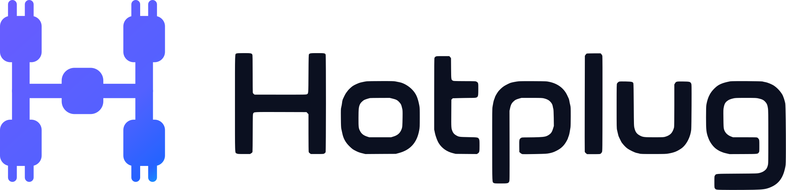

<p align="center">
  <picture>
    <source media="(prefers-color-scheme: dark)" srcset="assets/logo-dark.svg">
    
  </picture>
</p>

<p align="center"><b>Pick any. Code on.</b></p>

<p align="center">
  <a href="https://www.npmjs.com/package/anypick"></a>
  <a href="#requirements"></a>
  <a href="./LICENSE"></a>
</p>

---

Your Claude Code subscription, your Codex login, your Gemini account, your
OpenRouter key — AnyPick makes any of them the engine behind any supported CLI.

```bash
anypick use claude --with grok/work    # Claude Code, powered by your Grok account
anypick run claude
```

```text
Claude is the client.
grok/work is the source.
use makes it the default.
run launches it.
```

Auth snapshots, local proxies, protocol conversion, env injection, and client
config files are AnyPick's job. You pick a **client** and a **source**.

## Install

```bash
npm install -g anypick     # or: pnpm add -g anypick
anypick
```

On the first interactive run, bare `anypick` asks which daily surface to use:
the Terminal UI or, when available, the menu-bar Tray. AnyPick remembers the
answer. Use `anypick --tui`, `anypick --tray`, or the explicit `anypick tui` and
`anypick tray` commands to override it for one run.

The binary is installed as `anypick`. Later, `anypick update` upgrades an
npm-installed copy (`--check` reports only).

Optional shell completion:

```bash
source <(anypick completion zsh)   # or bash | fish
```

### Requirements

Node.js ≥ 22.5. AnyPick stores its data in SQLite through `node:sqlite`, which
needs that version; Node may still print an `ExperimentalWarning` for it, which
the CLI entry suppresses.

### Support policy

AnyPick's supported release platform is **Linux on Node.js 22.5 or newer**.
The CI matrix verifies that contract from the packed tarball. macOS-specific
tray support is best effort; Windows is not a supported platform. See
[`SECURITY.md`](./SECURITY.md) for supported security-fix versions and private
reporting instructions.

### What the npm package includes

The CLI, TUI, and every proxy are pure JavaScript and work from `npm install -g
anypick` alone. The **desktop tray is not shipped in the npm tarball** and needs
one extra step per platform:

| Platform    | Tray requirement                                                                                              |
| ----------- | ------------------------------------------------------------------------------------------------------------- |
| macOS       | Xcode Command Line Tools. The helper is compiled from bundled Swift on first `anypick tray` run, then cached.  |
| Linux       | The `anypick-tray-linux-x64` helper from the matching GitHub release, either on `PATH` as `anypick-tray` or at an absolute `ANYPICK_TAURI_TRAY_BINARY`. |
| Windows     | Not supported.                                                                                                |

Without a helper on Linux, `anypick tray` still runs: it supervises your enabled
proxies in **headless mode** and prints that no tray was found. On macOS a
missing Xcode Command Line Tools install fails with `TRAY_BUILD_FAILED` instead,
since the helper is built rather than downloaded. Either way `anypick tui` and
every other command work normally.

### From source

```bash
pnpm install && pnpm build
pnpm link --global   # optional
```

## Mental model

| Word        | Meaning                                                                                               |
| ----------- | ----------------------------------------------------------------------------------------------------- |
| **Client**  | CLI you run: `claude`, `codex`, `gemini`, `kiro`                                                      |
| **Source**  | Account `grok/work` / `gemini/work`, gateway `openrouter-work`, pool `pool:gemini`, or preset `@work` |
| **Binding** | Concrete snapshot: this client → this source (+ model roles)                                          |
| **Preset**  | Editable template (`@name`) — only after explicit `--save`                                            |

```
use   = set default binding (persistent)
run   = launch with binding (ephemeral; does not rewrite live defaults)
link  = project-local binding
```

Grammar (always):

```bash
anypick use|run <client> --with <source|@preset>
```

|               |                                                                          |
| ------------- | ------------------------------------------------------------------------ |
| Data          | `~/.anypick/anypick.db`                                                  |
| Override home | `ANYPICK_HOME=/path`                                                     |
| Interactive   | bare `anypick` on a TTY opens the command-center launcher                 |

Global flags: `--json` · `-v` · `-q` · `--dry-run` · `--reveal` · `--no-input` · `-y`

---

## Daily commands

```bash
# Set defaults
anypick use claude --with grok/work
anypick use claude --with openrouter-work
anypick use claude --with @work-stack          # preset
anypick use claude --current                   # re-apply stored snapshot
anypick use claude --with grok/work --save work-stack

# Launch
anypick run claude                             # uses project then global binding
anypick run claude --with grok/work            # one-shot; does not change bindings
anypick run codex --with openrouter-work

# Inspect
anypick current
anypick current claude
anypick list                                   # accounts · gateways · clients · presets
anypick list accounts
anypick list gateways

# Projects
anypick link claude                            # from global binding
anypick link claude --with grok/work
anypick unlink claude

# Add sources
anypick add account codex --current --name personal
anypick add account grok --new --name work
anypick add gateway openrouter-work \
  --provider openrouter \
  --endpoint https://openrouter.ai/api/v1 \
  --api-key "$OPENROUTER_API_KEY"

# Cleanup / health
anypick reset claude
anypick doctor
anypick doctor --fix -y                        # only safe AnyPick-owned fixes
```

Non-TTY / CI: `use <client>` requires `--with` or `--current` (exit `2` if missing). No prompts.

---

## Sources

### Accounts (native logins)

| Provider     | Live auth                              | How Claude/Codex use it                                         |
| ------------ | -------------------------------------- | --------------------------------------------------------------- |
| **claude**   | Claude Code Keychain / `~/.claude/.credentials.json` | direct for Claude Code only                              |
| **codex**    | `~/.codex/auth.json`                   | direct for Codex only                                           |
| **grok**     | `~/.grok/auth.json`                    | built-in dual proxy (OpenAI + Anthropic)                        |
| **opencode** | OpenCode auth store                    | built-in Zen/Go dual proxy                                      |
| **gemini**   | `~/.gemini/` (`.env`, oauth, accounts) | built-in dual proxy → Gemini API (API key or Code Assist OAuth) |
| **kiro**     | AWS SSO kiro tokens                    | external `kirolink` / `kiro-proxy` if installed                 |

```bash
# After logging in with the native tool:
anypick add account claude --current --name personal
anypick add account codex --current --name personal
anypick add account grok --current --name work
anypick add account gemini --current --name work

anypick use codex --with codex/personal
anypick use claude --with grok/work
anypick use claude --with gemini/work              # starts Gemini proxy if needed
anypick run claude
```

**Dynamic model discovery:** the Gemini proxy reads `models.list` for API-key accounts and Code Assist `fetchAvailableModels` for OAuth accounts (with quota metadata as a legacy fallback). Display names, rollout IDs, defaults, and ordering come from that live catalog. The OpenCode proxy intersects the live Zen/Go catalogs with provider metadata to choose the correct Messages, Chat Completions, Responses, or Google protocol. The Grok proxy forwards the authenticated upstream `/v1/models` catalog and requested model IDs unchanged. These proxies do not inject a static model list when discovery is unavailable, so newly released models do not require a AnyPick release. Set `OPENCODE_MODEL_METADATA_URL` to override the OpenCode metadata source, or to `none` to disable enrichment.

**Reasoning and thinking:** compatibility translations preserve Codex/OpenAI `reasoning_effort` and Responses `reasoning.effort`, Claude `output_config.effort`, adaptive thinking, manual `budget_tokens`, and visible thinking summaries. Native Anthropic/OpenAI routes remain pass-through. Google routes translate the same intent to Gemini `thinkingConfig` and keep thought summaries separate from final answer text. Gemini also implements the modern `/v1/responses` request and SSE lifecycle required by current Codex CLI releases, including reasoning items and function calls.

Managed proxies start automatically when the transport needs them. Manual lifecycle remains under `anypick proxy` for debugging.

On macOS, closing the default TUI hands proxy ownership to a native SwiftUI
menu-bar popover (without a Dock icon). AnyPick opens iTerm2 when it is installed
and falls back to Terminal. The popover is deliberately focused on **Claude Code**
and **Codex**: each has a compact route card with separate **Native** and
**Gateways & proxies** choices. Native accounts switch directly and never ask for
a model; gateway routes are one-click only when they already have a saved default
model. Routes that need a model picker stay in AnyPick. Gemini and Kiro are not
proxy targets in the tray: their native account buttons appear only when AnyPick
has a saved account and the matching CLI/IDE is installed, so the popover never
shows dead or disabled rows. Every switch uses the same activation journal and
rollback path as `anypick use`. AnyPick never force-quits an app that owns its
credentials — quit Antigravity completely, retry the switch, then reopen it. The
popover also shows live quota cards when a provider exposes them, and has one-click
controls to restart enabled proxies, stop every proxy, open AnyPick, or quit
cleanly. On Linux, a packaged Tauri tray helper owns the same lifecycle; if the
helper is not installed, AnyPick safely falls back to a headless background
supervisor. Use the CLI commands below to inspect or stop it.

The macOS popover stays compact: Claude Code or Codex without an alternate
switchable source is omitted, and unavailable routes never appear as disabled
rows. Usage reads only the credential currently live on disk and never opens a
saved account just to measure its quota.

```bash
anypick tray          # open or start the desktop Tray
anypick tray start
anypick tray status
anypick tray stop      # quits the supervisor and stops every AnyPick-owned proxy
```

Inside the TUI, press `t` for runtime controls or `Shift+D` to ensure the Tray
is running and detach from the terminal. A normal `q` only closes the TUI and
does not change the current Tray or proxy state. `anypick proxy stop` with no
provider/account also stops all running account proxies, including an inactive
account left from an older session.

### Gateways vs proxies

|           | **Proxy** (account)              | **Gateway** (API profile)               |
| --------- | -------------------------------- | --------------------------------------- |
| Auth      | Login snapshot (+ local process) | Endpoint + API key stored in AnyPick    |
| Bind apps | Proxy board → manage apps        | Gateways (`g`) → manage apps            |
| Models    | Per app when binding             | Gateway defaults + per app when binding |

Both end the same way: **client uses a source** (`use claude --with …`).

### Model map (Claude roles)

When you attach a proxy **or gateway** to Claude (TUI **manage apps** or after confirm), AnyPick sets:

- `ANTHROPIC_MODEL` (default)
- `ANTHROPIC_DEFAULT_SONNET_MODEL` / `OPUS` / `HAIKU`

Defaults come from the running proxy's live `/v1/models` catalog when available. Re-edit with **`m`** on Proxy or Enter on an app already using the proxy.

### Multi-account pool (opt-in)

Default remains **one proxy process per account**. Enable multi only when you want one endpoint and failover:

```bash
anypick proxy pool enable gemini -p 4130
anypick proxy pool member gemini work on
anypick proxy pool member gemini alt off
anypick use claude --with pool:gemini
anypick proxy pool disable gemini          # back to single-account
```

TUI Proxy board: **`p`** toggles multi pool; **space** on a member pauses/enables it.

### Gateways (API endpoint + key + models)

```bash
anypick add gateway openrouter-work \
  --provider openrouter \
  --endpoint https://openrouter.ai/api/v1 \
  --api-key "$OPENROUTER_API_KEY" \
  --model anthropic/claude-sonnet-4 \
  --models anthropic/claude-sonnet-4 openai/gpt-5.6-sol google/gemini-3.1-pro

anypick use claude --with openrouter-work
anypick run claude
```

For Codex, `--models` writes a managed model catalog so these gateway models
appear in `/model`. Local account proxies discover their live `/v1/models`
catalog automatically whenever AnyPick activates Codex.

Catalog providers: `anthropic` · `openai` · `openrouter` · `grok-api` · `litellm` · `local` · `custom`

### Presets

```bash
anypick use claude --with grok/work --save work-stack
anypick use claude --with @work-stack
anypick preset list
anypick preset edit work-stack --model …
```

Editing a preset never rewrites existing global/project bindings (they are snapshots).

---

## Projects

```bash
cd ~/src/my-app
anypick link claude                  # copy global binding into this project
anypick link claude --with grok/work
anypick run claude                   # project binding wins over global
anypick unlink claude
```

---

## Clients

```bash
anypick clients
# claude  — Claude Code (ANTHROPIC_*; isolated temp home on run)
# codex   — Codex CLI
# gemini  — Gemini CLI (GEMINI_API_KEY / GEMINI_MODEL)
# kiro    — Kiro
```

`anypick run` uses an **isolated temporary client home** for Claude / Codex / Kiro so live config is not patched for one-shot runs. Cleanup runs after normal exit and after SIGINT/SIGTERM.

Interactive TUI: run bare `anypick` on a TTY → **Apps** / **Accounts** / **Gateways** / **Proxy**. Accounts switches native logins directly; `f` filters Accounts or Gateways by provider.

---

## Proxy (advanced)

Built-in and external proxies are usually started by `use` / `run`. Manual control:

```bash
anypick proxy
anypick proxy start
anypick proxy stop
anypick proxy enable grok work -p 8080
anypick proxy enable gemini work -p 4130
anypick proxy config gemini work --oauth-source auto        # default: Gemini CLI → Antigravity
anypick proxy config gemini work --oauth-source antigravity # optional source override
anypick proxy logs gemini
anypick proxy pool enable gemini -p 4130   # opt-in multi-account
```

| Provider default port |        |
| --------------------- | ------ |
| grok                  | `8080` |
| kiro                  | `4119` |
| opencode              | `4120` |
| gemini                | `4130` |

The OpenCode proxy picks the Zen or Go catalog from the live account itself;
`--auth-mode public` pins it to Zen. `OPENCODE_PROXY_UPSTREAM` overrides the
upstream base URL.

Gemini auth defaults to `auto`: it respects the Gemini CLI's selected OAuth/API-key login first, then reads the signed-in Antigravity credential from macOS Keychain when the CLI catalog does not expose the requested model or returns an entitlement error. Successful catalog aliases are resolved within the same auth source, so an Antigravity rollout ID is never sent through Gemini CLI by mistake. `--oauth-source gemini-cli|antigravity` pins one source for debugging or policy control.

---

## Doctor & errors

```bash
anypick doctor
anypick doctor --fix --dry-run
anypick doctor --fix -y
```

`--fix` only touches the hard allowlist (stale locks/PIDs, orphan proxies, temp overlays, permissions, journal rollback). It never mutates native auth or bindings.

| Exit  | Meaning                                                   |
| ----- | --------------------------------------------------------- |
| `0`   | success                                                   |
| `2`   | invalid usage (missing client/source, non-TTY bare `use`) |
| `3`   | not found                                                 |
| `5`   | capability conflict / unsupported transport / no binding  |
| `7`   | missing required dependency (e.g. external proxy binary)  |
| `130` | cancelled (SIGINT)                                        |

---

## Manage resources

```bash
# Accounts
anypick account list
anypick account refresh codex
anypick account refresh codex --all
anypick account remove codex old -y
anypick account export codex work -o ./work.json
anypick account import codex work -i ./work.json

# Gateways
anypick gateway list
anypick gateway show openrouter-work
anypick gateway edit openrouter-work -m anthropic/claude-sonnet-4
anypick gateway remove old-gateway -y

# Presets
anypick preset list
anypick preset show work-stack
anypick preset remove work-stack

# Plugins — a provider/client/catalog you wrote, without forking the CLI
anypick plugin add ./acme-provider    # installs it disabled
anypick plugin enable acme-provider   # the trust decision; prompts
anypick plugin trust acme-provider    # re-pin after its code changes
anypick plugin list
```

A plugin runs in the AnyPick process, so it is never loaded until you enable it
by name, and only at the entry-module digest you approved — verified before the
module is imported. There is no sandbox: an enabled plugin can read the same
credentials AnyPick manages, so treat enabling one as running its author's code.
`ANYPICK_NO_PLUGINS=1` skips loading entirely. See
[`adr/0012-plugin-trust-boundary.md`](./adr/0012-plugin-trust-boundary.md) and
[`SECURITY.md`](./SECURITY.md).

---

## Examples

### Claude on Grok

```bash
# login with Grok CLI first
anypick add account grok --current --name work
anypick use claude --with grok/work
anypick run claude
```

### Codex multi-account

```bash
codex login
anypick add account codex --current --name personal
# add another login (clears live auth so you can re-login):
anypick add account codex --new --name work
anypick use codex --with codex/work
anypick run codex
```

### OpenRouter → Claude

```bash
anypick add gateway openrouter-work \
  --provider openrouter \
  --endpoint https://openrouter.ai/api/v1 \
  --api-key "$OPENROUTER_API_KEY" \
  --model anthropic/claude-sonnet-4

anypick use claude --with openrouter-work
anypick run claude
```

### One-shot without changing defaults

```bash
anypick run claude --with openrouter-work
# global binding unchanged
```

### Project override

```bash
anypick use claude --with grok/work          # global
cd ~/src/client-a
anypick link claude --with openrouter-work   # project only
anypick run claude
```

---

## Command reference

| Command                                       | Description                          |
| --------------------------------------------- | ------------------------------------ |
| `anypick`                                     | Interactive menu (TTY)               |
| `use <client> --with <source>`                | Set global binding                   |
| `use <client> --current`                      | Re-apply stored global snapshot      |
| `use <client> --with … --save <name>`         | Bind and create preset               |
| `run <client> [--with …]`                     | Launch (project → global → error)    |
| `current [client]`                            | Show effective bindings              |
| `list [accounts\|gateways\|clients\|presets]` | Inventory                            |
| `add account \| gateway`                      | Create sources                       |
| `link` / `unlink`                             | Project bindings                     |
| `reset <client>`                              | Remove AnyPick-managed client config |
| `account` / `gateway` / `preset`              | CRUD for resources                   |
| `proxy`                                       | Manual proxy lifecycle               |
| `tray`                                        | Background proxy supervisor          |
| `plugin`                                      | Install and trust extensions         |
| `doctor`                                      | Diagnose; optional safe `--fix`      |
| `update [--check]`                            | Self-update from npm                 |
| `completion zsh\|bash\|fish`                  | Shell completion                     |

---

## Documentation

Long-form docs live in [`docs/`](./docs/) and are published as a static site.

### Programmatic API

The supported library entrypoint is asynchronous and opens a fully migrated,
recovered application. Importing `anypick` itself performs no filesystem,
process, plugin, or SQLite work.

```ts
import { createAnyPickApp } from 'anypick';

const app = await createAnyPickApp({ root: '/safe/anypick-root' });
try {
  console.log(await app.accounts.list('grok'));
} finally {
  app.close();
}
```

Use `anypick/adapters` for supported extension contracts and `anypick/types`
for domain types. `anypick/testing` is intentionally unstable test plumbing;
all other deep imports are unsupported and blocked by the package export map.

---

## Development

```bash
pnpm install
pnpm dev            # one local entry — CLI/TUI/tray/proxy from source
pnpm dev tray start
pnpm check          # format + lint + typecheck + test
pnpm test
pnpm build          # production dist/ (tsc declarations + Vite ESM)
pnpm package        # clean dist + build + npm tarball
```

Docs site is a separate package: `cd docs && pnpm install && pnpm dev`.

```
src/
  cli/           primary commands, interactive, help, completion
  core/          sqlite, bindings, planner, executor, journal, locks, doctor
  providers/     claude, codex, grok (+proxy), kiro, opencode (+proxy)
  providers/protocol/  shared wire-format translation (anthropic, gemini)
  clients/       claude-code, codex, kiro (isolation manifests)
  sources/       account + gateway SourceAdapter.transportFor
  catalog/       gateway model catalogs
  tui/           Ink UI; tui/model/ holds the pure view models
  tray/          menu-bar/system-tray supervisor
  network/       shared HTTP plumbing for proxies
  utils/         errors, process supervision, fs helpers
```

### Why is it like this?

- [`adr/`](./adr/) — accepted architecture decisions, each with context and
  consequences. [`adr/README.md`](./adr/README.md) is the index. Start here, and
  cite ADR numbers (not spec sections) in new code comments.
- [`CONTRIBUTING.md`](./CONTRIBUTING.md) — layering rules, how to add a provider
  or client, lint policy.
- [`docs/history/`](./docs/history/) — the original design and planning
  documents, kept for provenance. Not current documentation; several source
  comments still cite their `§` numbers, which is why they are still around.

TypeScript / Vitest / Vite are pinned to the current majors used in CI; they are
newer stacks — re-check when upgrading.

## Brand

Assets live in [`assets/`](./assets/): logo lockups, logomark, 512px app icon,
and the macOS menu-bar template glyph.

| Token         | Hex       | Used for                                        |
| ------------- | --------- | ----------------------------------------------- |
| Navy          | `#15151D` | Dark backgrounds                                |
| Violet        | `#7357FF` | Wordmark                                        |
| Electric Blue | `#60A5FA` | Selection and focus — legible on light and dark |
| Cyan          | `#35D6E8` | Logo gradient, and dark surfaces only           |
| Light Gray    | `#F7F7FA` | Light backgrounds                               |

Cyan is kept out of the terminal UI on purpose: a terminal's background cannot
be detected, and cyan on a light theme is about 1.9:1.

---

## License

MIT © AnyPick contributors. See [`LICENSE`](./LICENSE).
