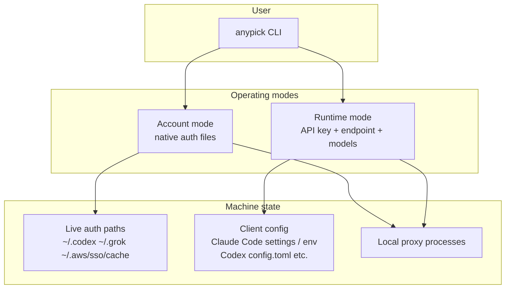
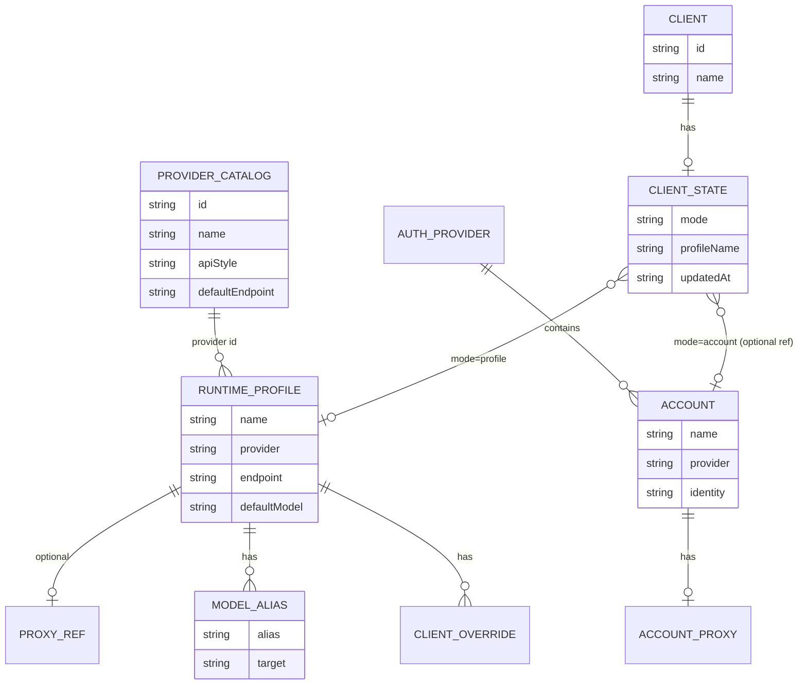
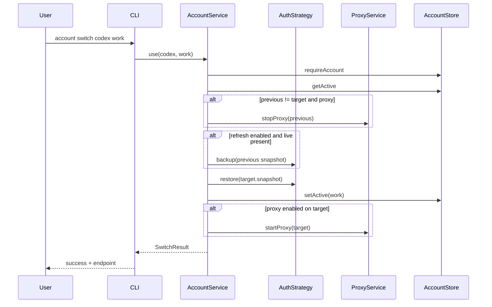
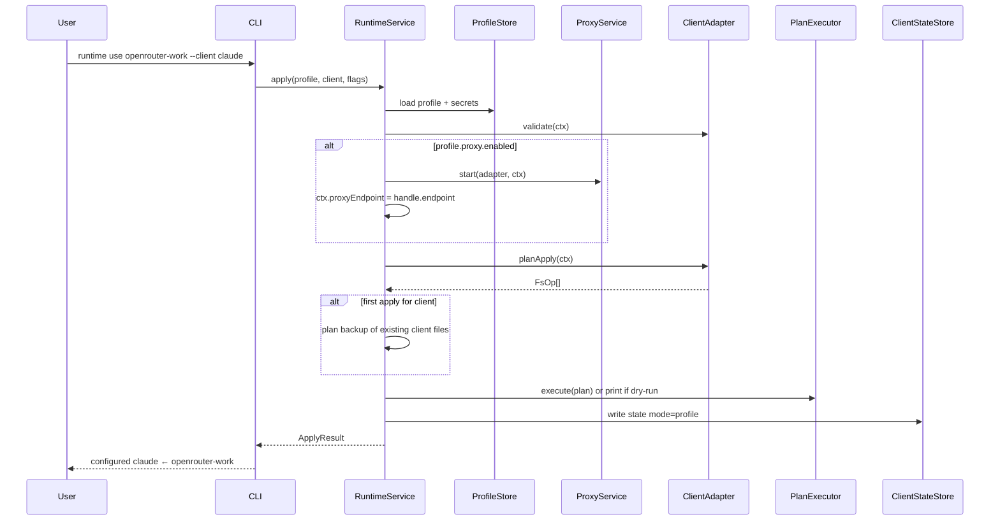
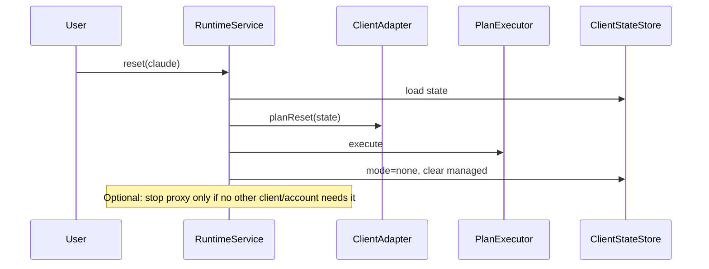
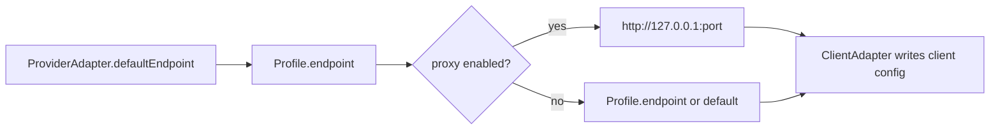

# anypick — Unified Account & Runtime Configuration CLI

| Field | Value |
|-------|--------|
| **Title** | anypick: Unified Account & Runtime Configuration CLI |
| **Author** | TBD |
| **Date** | 08-08-2026 |
| **Status** | Implemented (v0.2 foundation) |
| **Notes** | Core account + profile + runtime + client adapters shipped. Providers own their account/pool source policy through `sourceAdapter` / `poolSourceAdapter`; registries are app-scoped. An external plugin loader remains an explicit follow-up, not an implied capability. |
| **Project** | `anypick` (keep existing package/binary name) |
| **Workspace** | `/Users/erik/workspace/lab/js/anypick` |

---

## Overview

`anypick` today is a focused, well-structured CLI for **backing up and switching local auth snapshots** for Codex, Grok, and Kiro, with optional **provider-owned compatibility proxies**. It already embodies the right principles: pluggable providers, opaque snapshots, filesystem storage under `~/.anypick`, minimal dependencies (`commander`, `@clack/prompts`, `picocolors`), and core that never parses provider secrets.

This design **extends** that foundation into a unified control plane for AI developer tooling:

1. **Accounts** (existing) — restore native login material (auth files, SSO tokens).
2. **Runtime Profiles** (new) — reusable API-key / endpoint / model-mapping configurations.
3. **Clients** (new) — adapters that apply a profile (or clear it) into Claude Code, Codex, Kiro, etc. without the user editing env files by hand.
4. **Split adapters** — Provider, Auth Strategy, Proxy, and Client are separate contracts so adding a gateway or AI app is one adapter, not a core change.

The migration path is evolutionary: keep `AccountStore` / `AccountService` / existing providers working; introduce parallel registries and services; restructure command surface into clear nouns (`account`, `profile`, `runtime`, `proxy`, `doctor`) while preserving aliases for current commands during a deprecation window.

---

## Background & Motivation

### Current state (v0.1)

| Layer | Location | Role |
|-------|----------|------|
| CLI | `src/cli.ts`, `src/cli/commands.ts`, `interactive.ts`, `format.ts` | commander + interactive menu |
| Service | `src/core/service.ts` (`AccountService`) | save / use / delete / import / export / proxy lifecycle |
| Store | `src/core/store.ts` (`AccountStore`) | `~/.anypick/providers/<id>/accounts/<name>/` |
| Registry | `src/core/registry.ts` | in-memory `Provider` map |
| Providers | `src/providers/{codex,grok,kiro}.ts` | backup/restore (+ proxy for grok/kiro) |
| Types | `src/types.ts` | `Provider`, `AccountMeta`, `ProxyContext`, … |

**Pain points this design addresses**

| Pain | Today | Desired |
|------|-------|---------|
| API gateways | Manual env vars / client config files | `anypick runtime use openrouter-work --client claude` |
| Multi-client reuse | One provider ≈ one tool's auth files | One Runtime Profile applied to Claude Code *and* Codex |
| Model aliases | None | Profile maps `claude-sonnet` → provider-specific model id |
| Client reset | Manual cleanup | `anypick runtime reset --client claude` |
| Adapter boundaries | Auth + proxy fused on `Provider` | Explicit Auth / Proxy / Client adapters |
| Discoverability | Flat `save`/`use` commands | Noun-verb groups + `doctor` + dry-run |

### What we deliberately keep

- FS-only store (no DB).
- Opaque account snapshots; secrets not in `meta.json`.
- Safe switch re-backup of previous active account (token refresh capture).
- Provider-owned proxies; core only orchestrates.
- Non-goals: login automation, browser automation, credential generation, usage bypass, cloud sync.

---

## Goals & Non-Goals

### Goals

1. One-command **account switch** (existing, refined under `account` noun).
2. One-command **runtime apply** to a client from a named profile.
3. One-command **client reset** of anypick-managed settings.
4. CRUD for **Runtime Profiles** (create, edit, delete, rename, duplicate, list).
5. **Model mapping** and **client-specific overlays** on profiles.
6. **Proxy** enable/disable/start/stop/status with auto-start on account or profile activation when enabled.
7. Plugin architecture: new provider / client / auth / proxy = new adapter only.
8. Excellent DX: interactive + non-interactive, colors, dry-run, verbose, doctor, completion.
9. Backward-compatible migration of `~/.anypick` account data.
10. Cross-platform: macOS, Linux, Windows; Node ≥ 20; pnpm; TypeScript.

### Non-Goals

- Login / browser / OAuth automation.
- Generating or stealing credentials.
- Quota / rate-limit bypass.
- Cloud multi-device sync.
- Becoming a full secrets manager (no sealed vaults, no OS keychain *required* in v1 — see Open Questions).
- Rewriting the project from scratch or changing the binary name without strong need.

---

## Key Decisions

| # | Decision | Choice | Rationale |
|---|----------|--------|-----------|
| K1 | Package / binary name | **Keep `anypick`** | Short, already linked in PATH, data root `~/.anypick` and `ANYPICK_HOME` established; rename cost (muscle memory, docs, exports) outweighs branding. Description expands; keywords add `runtime`, `profiles`. |
| K2 | CLI framework | **Keep `commander`** | Already integrated (`buildProgram` in `commands.ts`), handles nested subcommands, version, global options. oclif is heavier; yargs/citty offer no clear win for this surface. Keep `@clack/prompts` for interactive, `picocolors` for output. |
| K3 | Evolution vs rewrite | **Evolve in place** | Core store/service/providers/tests are solid. Greenfield would reintroduce bugs and break `~/.anypick` users. Extract interfaces; add modules; deprecate flat commands. |
| K4 | Adapter split | **Four adapter kinds** + composition | `AuthStrategy` (file snapshot), `ProxyAdapter` (lifecycle), `ProviderAdapter` (catalog + optional default auth/proxy refs), `ClientAdapter` (apply/reset runtime). Existing `Provider` class becomes a **facade** composing Auth + optional Proxy for migration. |
| K5 | Accounts vs profiles | **Orthogonal, not exclusive** | Accounts restore *native tool auth*. Profiles apply *API runtime config* to *clients*. A machine may have both active. Per-client state records *how* that client is currently configured (`mode: account \| profile \| none`). Account switch does not wipe unrelated client runtime files; runtime apply does not delete account snapshots. |
| K6 | Mutual interference | **Client-scoped apply** | `runtime use <profile> --client X` only mutates client X. Optional `--all-clients` later. Account `use` only mutates that auth provider's live files (+ proxy). Explicit `runtime reset` undoes client config. |
| K7 | Secrets storage | **Separate secrets files, mode 0600** | Profiles: `~/.anypick/profiles/<name>/secrets.json` (apiKey, header values). Meta + non-secret config in `profile.json`. Never log secrets; redacted in `--json` unless `--reveal`. No DB. Optional future OS keychain backend behind same interface. |
| K8 | Client overlay model | **Profile base + clientOverrides** | Profile holds provider, endpoint, key, models, headers. `clientOverrides.claude` may set `defaultModel`, `sonnetModel`, etc. Client adapter merges base → overrides → writes tool-specific targets. |
| K9 | Command taxonomy | **Noun groups + aliases** | `account *`, `profile *`, `runtime *`, `proxy *`, `doctor`, `completion`. Keep `anypick use codex work` as alias → `account use` for one major version. |
| K10 | Plugin loading | **Builtin register + optional external entry** | v1: `registerBuiltin*()` like today. v1.1: load `~/.anypick/plugins/*.js` or `package.json` `"anypickPlugin"` — discoverable, no core edits for third-party. |
| K11 | Dry-run | **Global `--dry-run`** | Services return a `Plan` of filesystem ops; executor applies or prints. |
| K12 | Shell completion | **commander completion + static script** | Ship `anypick completion bash\|zsh\|fish` generating scripts; dynamic account/profile names via `anypick __complete` helper when practical. |
| K13 | Config schema version | **Root `~/.anypick/config.json` with `schemaVersion`** | Enables migrations; v0 data (no config.json) treated as schema 1 accounts-only. |
| K14 | Proxy attachment | **Attachable to Account and/or Profile** | Account proxy stays as today (`proxy.json` under account). Profiles may reference a `proxy` block for gateway cases that need a local shim. ProxyAdapter registry keyed by proxy id (e.g. `grok-openai`, `kirolink`). |

---

## Proposed Design

### 1. Overall architecture

```
┌──────────────────────────────────────────────────────────────────────────┐
│  CLI  (commander + @clack + picocolors)                                  │
│  anypick [account|profile|runtime|proxy|doctor|completion|…]              │
│  global: --json --verbose --dry-run --reveal                             │
└────────────────────────────────┬─────────────────────────────────────────┘
                                 │
                                 ▼
┌──────────────────────────────────────────────────────────────────────────┐
│  Application services (orchestration only — no tool-specific I/O)        │
│  ┌──────────────┐ ┌───────────────┐ ┌──────────────┐ ┌───────────────┐  │
│  │AccountService│ │ProfileService │ │RuntimeService│ │ ProxyService  │  │
│  │ (existing+)  │ │ (new)         │ │ (new)        │ │ (extract)     │  │
│  └──────┬───────┘ └───────┬───────┘ └──────┬───────┘ └───────┬───────┘  │
│         │                 │                │                 │          │
│         └────────────┬────┴────────────────┴────────┬────────┘          │
│                      ▼                              ▼                   │
│              ┌───────────────┐              ┌──────────────┐            │
│              │  PlanExecutor │              │ DoctorService│            │
│              │  (dry-run)    │              │              │            │
│              └───────────────┘              └──────────────┘            │
└──────────┬─────────────────────────────┬───────────────────┬────────────┘
           │                             │                   │
           ▼                             ▼                   ▼
┌────────────────────┐   ┌───────────────────────┐   ┌──────────────────┐
│  Stores (FS)       │   │  Registries           │   │  Shared utils    │
│  AccountStore      │   │  AuthStrategyRegistry │   │  fs, process,    │
│  ProfileStore      │   │  ProxyAdapterRegistry │   │  slug, errors,   │
│  ClientStateStore  │   │  ProviderRegistry     │   │  redaction, plan │
│  GlobalConfigStore │   │  ClientRegistry       │   │                  │
└────────────────────┘   └───────────┬───────────┘   └──────────────────┘
                                     │
           ┌─────────────────────────┼─────────────────────────┐
           ▼                         ▼                         ▼
   ┌───────────────┐        ┌────────────────┐        ┌────────────────┐
   │ AuthStrategies│        │ ProxyAdapters  │        │ ClientAdapters │
   │ codex-files   │        │ grok-openai    │        │ claude-code    │
   │ grok-files    │        │ kirolink       │        │ codex-cli      │
   │ kiro-files    │        │ (future)       │        │ kiro           │
   │ api-key (meta)│        │                │        │ (future)       │
   └───────────────┘        └────────────────┘        └────────────────┘
                                     │
                            ┌────────┴────────┐
                            │ Provider catalog│
                            │ (metadata only) │
                            │ openai, anthropic│
                            │ grok, openrouter │
                            │ litellm, local…  │
                            └─────────────────┘
```

**Design reasoning**

- **Services orchestrate; adapters mutate the world.** Matches existing `AccountService` pattern (`src/core/service.ts`) so new features feel familiar.
- **Registries stay in-memory at process start** (like `ProviderRegistry` today) — simple, testable, no plugin host complexity in v1.
- **PlanExecutor** unifies dry-run and real apply: every mutating path builds `FsOp[]` (write/copy/rm/chmod) then commits.
- **Provider catalog is not the same as AuthStrategy.** OpenRouter is a *provider* for profiles (defaults: base URL, model id style) without owning local auth files. Codex is both a *client* and has an *auth strategy* for ChatGPT login files.



---

### 2. Folder structure

#### Repository (target)

```
anypick/
├── package.json                 # name: anypick, bin: anypick
├── tsconfig.json
├── vite.config.ts                 # Vite Node/SSR build + Vitest configuration
├── DESIGN.md                    # keep; point to this RFC when merged
├── README.md
├── src/
│   ├── cli.ts                   # bin entry
│   ├── index.ts                 # public library exports
│   ├── types/
│   │   ├── index.ts
│   │   ├── account.ts           # AccountMeta, Account, … (from types.ts)
│   │   ├── profile.ts           # RuntimeProfile, ModelMap, …
│   │   ├── client.ts            # ClientId, ClientState, …
│   │   ├── adapters.ts          # AuthStrategy, ClientAdapter, ProxyAdapter, ProviderAdapter
│   │   ├── plan.ts              # FsOp, Plan, ApplyResult
│   │   └── proxy.ts             # ProxyContext, ProxyHandle, ProxyStatus
│   ├── core/
│   │   ├── paths.ts             # extended path helpers
│   │   ├── config.ts            # GlobalConfigStore (schemaVersion, defaults)
│   │   ├── plan.ts              # PlanBuilder + PlanExecutor
│   │   ├── redaction.ts         # secret masking for logs/json
│   │   ├── registry/
│   │   │   ├── providers.ts     # evolved ProviderRegistry
│   │   │   ├── auth.ts
│   │   │   ├── proxies.ts
│   │   │   └── clients.ts
│   │   ├── store/
│   │   │   ├── account.ts       # AccountStore (current store.ts)
│   │   │   ├── profile.ts       # ProfileStore
│   │   │   └── client-state.ts  # which profile/account each client uses
│   │   └── service/
│   │       ├── account.ts       # AccountService (current service.ts, slimmed)
│   │       ├── profile.ts
│   │       ├── runtime.ts       # apply / reset / status
│   │       ├── proxy.ts         # extracted proxy orchestration
│   │       └── doctor.ts
│   ├── adapters/
│   │   ├── auth/
│   │   │   ├── codex-files.ts
│   │   │   ├── grok-files.ts
│   │   │   └── kiro-files.ts
│   │   ├── proxy/
│   │   │   ├── grok-openai.ts   # from providers/grok.ts proxy methods + grok-proxy/
│   │   │   ├── kirolink.ts
│   │   │   └── external.ts      # shared helper (today proxy-process.ts)
│   │   ├── providers/
│   │   │   ├── catalog.ts       # openai, anthropic, grok, openrouter, litellm, local
│   │   │   └── legacy-facade.ts # implements old Provider for tests/compat
│   │   └── clients/
│   │       ├── claude-code.ts
│   │       ├── codex.ts
│   │       └── kiro.ts
│   ├── providers/               # TRANSITIONAL: re-exports facades until tests migrate
│   │   ├── index.ts
│   │   ├── codex.ts
│   │   ├── grok.ts
│   │   ├── kiro.ts
│   │   ├── proxy-process.ts
│   │   └── grok-proxy/          # unchanged entrypoints
│   ├── cli/
│   │   ├── program.ts           # buildProgram
│   │   ├── commands/
│   │   │   ├── account.ts
│   │   │   ├── profile.ts
│   │   │   ├── runtime.ts
│   │   │   ├── proxy.ts
│   │   │   ├── doctor.ts
│   │   │   ├── completion.ts
│   │   │   └── legacy.ts        # flat save/use/list aliases
│   │   ├── interactive.ts
│   │   ├── format.ts
│   │   └── context.ts           # wires services + flags
│   └── utils/
│       ├── errors.ts
│       ├── fs.ts
│       ├── process.ts
│       └── slug.ts
└── tests/
    ├── helpers.ts
    ├── account/
    ├── profile/
    ├── runtime/
    ├── adapters/
    ├── doctor/
    └── migration/
```

**Migration of existing files**

| Current | Target |
|---------|--------|
| `src/types.ts` | `src/types/*` (split by domain) |
| `src/core/store.ts` | `src/core/store/account.ts` |
| `src/core/service.ts` | `src/core/service/account.ts` + `proxy.ts` |
| `src/core/registry.ts` | `src/core/registry/providers.ts` |
| `src/providers/*` | Auth + Proxy adapters; temporary facades keep old tests green |
| `src/cli/commands.ts` | `src/cli/program.ts` + `commands/*` |

#### Runtime data layout (`~/.anypick` / `$ANYPICK_HOME`)

```
~/.anypick/
├── config.json                    # NEW: schemaVersion, defaults, ui prefs
├── providers/                     # UNCHANGED layout for accounts
│   └── <authProviderId>/          # codex | grok | kiro | …
│       ├── active                 # active account name
│       └── accounts/
│           └── <name>/
│               ├── meta.json
│               ├── proxy.json
│               ├── snapshot/      # secrets, 0600 files
│               └── runtime/       # proxy pid/logs/state
├── profiles/                      # NEW
│   └── <profileName>/
│       ├── profile.json           # non-secret definition
│       └── secrets.json           # apiKey, sensitive headers (0600)
├── clients/                       # NEW
│   └── <clientId>/
│       ├── state.json             # active mode, profile/account refs, managed keys
│       └── backup/                # pre-apply snapshots of client files we touch
└── plugins/                       # FUTURE optional external adapters
```

**Compatibility:** Existing trees under `providers/` require **no file moves**. First run with schema migration writes `config.json` `{ "schemaVersion": 2 }` and leaves accounts intact.

---

### 3. Domain model



#### Core types (illustrative)

```ts
/** Catalog entry — how to talk to an AI service (not local files). */
export interface ProviderAdapter {
  readonly id: string;            // "openrouter" | "anthropic" | "openai" | "grok" | …
  readonly name: string;
  readonly description: string;
  /** Protocol family for client adapters. */
  readonly apiStyle: "openai" | "anthropic" | "custom";
  readonly defaultEndpoint?: string;
  /** Suggest model map templates when creating a profile. */
  suggestModels?(): ModelMap;
}

/** Local native-auth backup/restore (today's Provider.backup/restore). */
export interface AuthStrategy {
  readonly id: string;            // "codex-files" | "grok-files" | "kiro-files"
  readonly name: string;
  readonly description: string;
  detectLive(): Promise<LiveAuthStatus>;
  backup(destDir: string): Promise<Partial<Pick<AccountMeta, "identity" | "label" | "notes">>>;
  restore(srcDir: string): Promise<void>;
  describeSnapshot?(srcDir: string): Promise<Partial<Pick<AccountMeta, "identity" | "label" | "notes">>>;
}

export interface ProxyAdapter {
  readonly id: string;            // "grok-openai" | "kirolink"
  readonly name: string;
  readonly compatibility: string;
  start(ctx: ProxyContext): Promise<ProxyHandle>;
  stop(ctx: ProxyContext): Promise<void>;
  status(ctx: ProxyContext): Promise<ProxyStatus>;
  readLogs?(ctx: ProxyContext, lines?: number): Promise<string>;
}

/** Maps logical alias → provider model id. */
export type ModelMap = Record<string, string>;

export interface RuntimeProfileMeta {
  name: string;
  provider: string;               // ProviderAdapter.id
  createdAt: string;
  updatedAt: string;
  label?: string;
  notes?: string;
  endpoint?: string;
  /** Non-secret header *names* listed here; values live in secrets. */
  headerNames?: string[];
  models: ModelMap;
  defaultModel?: string;
  /**
   * Per-client overlay. Keys are ClientAdapter.id.
   * Values are free-form but validated by the client adapter.
   */
  clientOverrides?: Record<string, Record<string, unknown>>;
  /** Optional proxy adapter id + config (enable/port/host/options). */
  proxy?: AccountProxyConfig & { adapterId?: string };
}

export interface RuntimeProfileSecrets {
  apiKey?: string;
  headers?: Record<string, string>;
}

export interface RuntimeProfile {
  meta: RuntimeProfileMeta;
  secrets: RuntimeProfileSecrets;
  profileDir: string;
}

export type ClientConfigMode = "none" | "profile" | "account";

export interface ClientState {
  clientId: string;
  mode: ClientConfigMode;
  /** When mode === "profile" */
  profileName?: string;
  /** When mode === "account" (rare; e.g. documenting that codex uses live auth) */
  accountRef?: { provider: string; name: string };
  updatedAt: string;
  /** Paths we last wrote / managed (for precise reset). */
  managedPaths: string[];
  /** Env keys we set in shell rc or client env files. */
  managedEnvKeys: string[];
}

export interface ApplyContext {
  profile: RuntimeProfile;
  clientId: string;
  dryRun: boolean;
  verbose: boolean;
  /** Active proxy endpoint if started for this apply. */
  proxyEndpoint?: string;
}

export interface ClientAdapter {
  readonly id: string;            // "claude" | "codex" | "kiro"
  readonly name: string;
  readonly description: string;
  /** Which ProviderAdapter.apiStyle values this client can consume. */
  readonly supportedApiStyles: Array<"openai" | "anthropic" | "custom">;

  /**
   * Validate profile (+ overrides) before write.
   * Throw AnyPickError with code CLIENT_CONFIG_INVALID.
   */
  validate(ctx: ApplyContext): Promise<void>;

  /**
   * Build plan to apply runtime configuration.
   * Must not write when called under dry-run executor (plan only).
   */
  planApply(ctx: ApplyContext): Promise<FsOp[]>;

  /**
   * Build plan to remove anypick-managed config and restore backups if present.
   * Preserve user settings outside managedPaths / managed markers.
   */
  planReset(state: ClientState): Promise<FsOp[]>;

  /** Human-readable current status for doctor / runtime status. */
  inspect(): Promise<ClientInspectResult>;
}

export interface ClientInspectResult {
  present: boolean;
  configPaths: string[];
  summary?: string;
  issues?: string[];
}

/** Back-compat facade: AuthStrategy + optional ProxyAdapter (current Provider). */
export interface LegacyProviderFacade {
  readonly id: string;
  readonly name: string;
  readonly description: string;
  readonly supportsProxy?: boolean;
  readonly proxyCompatibility?: string;
  readonly auth: AuthStrategy;
  readonly proxy?: ProxyAdapter;
  // methods delegate to auth / proxy — same signatures as today's Provider
}
```

#### Account vs Runtime Profile interaction

| Scenario | Behavior |
|----------|----------|
| `account use codex work` | Restores `~/.codex/auth.json` from snapshot; starts account proxy if enabled. Does **not** rewrite Claude Code settings. |
| `runtime use openrouter-work --client claude` | Writes Claude Code env/settings from profile; may start profile proxy. Does **not** change Codex auth.json. |
| Both active on same machine | Allowed. Different targets. `doctor` reports both. |
| Same client, second apply | New profile replaces previous managed config; previous profile name updated in `clients/<id>/state.json`. Optional backup of pre-first-apply client files kept under `clients/<id>/backup/`. |
| `runtime reset --client claude` | Removes managed keys/files; restores backup if we created one; `mode: none`. |
| Profile needs Grok OIDC proxy | Profile.proxy.adapterId = `grok-openai` and user still needs grok account active for token files — document as dual step, or profile can point snapshot path (v1: require `account use grok X` first). |

**Rule of thumb for users**

- **Logged-in tool sessions** (ChatGPT Codex, Grok CLI, Kiro SSO) → **Accounts**.
- **API keys / gateways / OpenRouter / LiteLLM** → **Runtime Profiles** + **Clients**.

---

### 4. Adapter interfaces

Composition model:

```
ProviderAdapter  ── catalog defaults (endpoint, apiStyle, model hints)
AuthStrategy     ── account backup/restore only
ProxyAdapter     ── process lifecycle only
ClientAdapter    ── apply/reset client runtime only
```

Existing code maps as:

| Today (`src/providers/codex.ts`) | Future |
|----------------------------------|--------|
| `CodexProvider.detectLive/backup/restore` | `CodexFilesAuth` (`AuthStrategy`) |
| (no proxy) | — |
| — | `CodexClient` applies `OPENAI_API_KEY`, base URL, model to Codex config |
| — | `ProviderAdapter` id `openai` for profiles |

| Today (`grok.ts` + `grok-proxy/`) | Future |
|-----------------------------------|--------|
| auth methods | `GrokFilesAuth` |
| startProxy/stopProxy/… | `GrokOpenAIProxy` |
| facade `GrokProvider` | composes both for legacy CLI |

| Today (`kiro.ts`) | Future |
|-------------------|--------|
| auth | `KiroFilesAuth` |
| kirolink via `proxy-process.ts` | `KirolinkProxy` |
| — | `KiroClient` for any Kiro-specific runtime settings |

#### Registration (startup)

```ts
// src/adapters/register.ts
export function registerBuiltins(regs: Registries): void {
  regs.auth.register(codexFilesAuth);
  regs.auth.register(grokFilesAuth);
  regs.auth.register(kiroFilesAuth);

  regs.proxies.register(grokOpenAIProxy);
  regs.proxies.register(kirolinkProxy);

  regs.providers.register(openaiProvider);
  regs.providers.register(anthropicProvider);
  regs.providers.register(grokCatalogProvider);
  regs.providers.register(openRouterProvider);
  regs.providers.register(liteLLMProvider);
  regs.providers.register(localGatewayProvider);

  regs.clients.register(claudeCodeClient);
  regs.clients.register(codexClient);
  regs.clients.register(kiroClient);

  // Legacy account provider ids stay stable for paths under providers/codex etc.
  regs.legacyAccounts.register(facade("codex", codexFilesAuth));
  regs.legacyAccounts.register(facade("grok", grokFilesAuth, grokOpenAIProxy));
  regs.legacyAccounts.register(facade("kiro", kiroFilesAuth, kirolinkProxy));
}
```

**Success criterion mapping**

| Add… | Implement… | Register in… | Core changes? |
|------|------------|--------------|---------------|
| New native login tool | `AuthStrategy` (+ optional `ProxyAdapter`) | `register.ts` | No |
| New API gateway | `ProviderAdapter` | `register.ts` | No |
| New AI app | `ClientAdapter` | `register.ts` | No |
| New proxy binary | `ProxyAdapter` | `register.ts` | No |

#### Client adapter responsibilities (Claude Code example)

Claude Code typically needs:

- API key
- Base URL
- Default model
- Optional Haiku / Sonnet / Opus overrides
- Future env vars

```ts
// Conceptual merge order
const overlay = profile.meta.clientOverrides?.claude ?? {};
const env = {
  ANTHROPIC_API_KEY: secrets.apiKey,          // or OPENAI_* depending on apiStyle
  ANTHROPIC_BASE_URL: effectiveEndpoint,
  // model mapping
  // CLAUDE_CODE_* or settings.json fields — exact keys owned by adapter
  ...mapModels(profile.meta.models, overlay),
  ...overlay.env,
};
```

The **adapter owns** whether it writes:

- process-specific settings JSON under `~/.claude/…`, and/or
- a small env file that the user sources, and/or
- documented export instructions when the tool only supports shell env.

v1 preference: **write the client's native config files** when paths are well-known; fall back to `~/.anypick/clients/<id>/env.sh` (and `.ps1` on Windows) plus a printed `source` hint. Exact Claude/Codex paths are finalized during implementation against current tool docs (Open Question if formats churn).

#### Managed-region markers

To reset safely without destroying user edits:

```toml
# codex config.toml — anypick-managed block
# >>> anypick:managed
model = "…"
# <<< anypick:managed
```

Or JSON:

```json
{
  "_anypickManaged": {
    "keys": ["env.ANTHROPIC_API_KEY", "model"]
  }
}
```

Client adapters use markers or `ClientState.managedPaths` + file backups. Prefer **backup-on-first-apply** + **key-level managed list** over whole-file overwrite when the config file is shared with user settings.

---

### 5. CLI command design

#### Global options

| Flag | Effect |
|------|--------|
| `--json` | Machine-readable output |
| `--verbose` / `-v` | Debug logs (paths, plan ops; secrets redacted) |
| `--dry-run` | Print plan; no writes, no process start |
| `--reveal` | Allow secrets in output (dangerous; for export debugging) |
| `--version` / `-V` | Version |
| `ANYPICK_HOME` | Data root override |

#### Command tree

```
anypick                          Interactive hub (extended menu)
anypick doctor                   Health checks
anypick completion <shell>       bash | zsh | fish

anypick account list [provider]
anypick account current <provider>
anypick account backup <provider> <name>     # was: save
anypick account switch <provider> <name>     # was: use
anypick account delete <provider> <name>
anypick account rename <provider> <old> <new>
anypick account export|import …

anypick profile list
anypick profile show <name>
anypick profile create <name> [options]
anypick profile edit <name> [options]
anypick profile delete <name>
anypick profile rename <old> <new>
anypick profile duplicate <name> <newName>

anypick runtime use <profile> --client <id> [--no-proxy]
anypick runtime reset --client <id>
anypick runtime status [--client <id>]
anypick runtime which --client <id>

anypick proxy enable …   # account-scoped (existing) OR --profile <name>
anypick proxy disable …
anypick proxy start|stop|status|logs …

anypick providers                 Catalog (API providers + auth providers)
anypick clients                   List client adapters
```

#### Backward-compatible aliases (v1)

| Legacy | Maps to |
|--------|---------|
| `anypick save …` | `account backup …` |
| `anypick use <provider> <name>` | `account switch …` |
| `anypick list` | `account list` |
| `anypick current` | `account current` |
| `anypick delete` | `account delete` |
| `anypick export/import` | `account export/import` |
| `anypick providers` | list both catalog + auth facades (annotated) |

Deprecation: warn once per invocation when using legacy flat commands; remove aliases in next major after notice.

#### Everyday flows

```bash
# ── Accounts (unchanged mental model) ──
# Log into Codex as work, then:
anypick account backup codex work
anypick account switch codex personal

# ── Runtime profiles ──
anypick profile create openrouter-work \
  --provider openrouter \
  --endpoint https://openrouter.ai/api/v1 \
  --api-key "$OPENROUTER_API_KEY" \
  --model-default "anthropic/claude-sonnet-4" \
  --map claude-sonnet=anthropic/claude-sonnet-4 \
  --map claude-opus=anthropic/claude-opus-4 \
  --map claude-haiku=anthropic/claude-haiku-4 \
  --client-override claude.defaultModel=claude-sonnet \
  --client-override claude.sonnetModel=claude-sonnet \
  --client-override claude.opusModel=claude-opus \
  --client-override claude.haikuModel=claude-haiku

anypick runtime use openrouter-work --client claude
anypick runtime use openrouter-work --client codex

anypick runtime reset --client claude
anypick doctor
```

Interactive create: `@clack` prompts for provider → endpoint default → api key (password) → models → optional client overrides.

#### Profile create/edit options (non-interactive)

| Option | Description |
|--------|-------------|
| `--provider <id>` | Required on create |
| `--endpoint <url>` | Base URL |
| `--api-key <key>` | Stored in secrets.json (prefer env `ANYPICK_API_KEY` to avoid shell history) |
| `--header <Name:Value>` | Repeatable; sensitive values → secrets |
| `--map <alias=target>` | Model map entry |
| `--model-default <id-or-alias>` | Default model |
| `--client-override <client.key=value>` | Nested override |
| `--proxy-adapter <id>` | Attach proxy |
| `--proxy-port <n>` | |

---

### 6. Configuration file format

#### `~/.anypick/config.json`

```json
{
  "schemaVersion": 2,
  "defaultClient": "claude",
  "defaults": {
    "proxyHost": "127.0.0.1"
  },
  "ui": {
    "color": true
  }
}
```

#### Account `meta.json` (unchanged)

```json
{
  "name": "work",
  "provider": "codex",
  "createdAt": "2026-08-08T10:00:00.000Z",
  "updatedAt": "2026-08-08T12:00:00.000Z",
  "label": "Work",
  "identity": "you@company.com",
  "notes": "optional"
}
```

#### Account `proxy.json` (unchanged)

```json
{
  "enabled": true,
  "port": 8080,
  "host": "127.0.0.1",
  "options": { "clientVersion": "0.2.101" }
}
```

#### Profile `profile.json` (non-secret)

```json
{
  "name": "openrouter-work",
  "provider": "openrouter",
  "createdAt": "2026-08-08T10:00:00.000Z",
  "updatedAt": "2026-08-08T10:00:00.000Z",
  "label": "OpenRouter Work",
  "endpoint": "https://openrouter.ai/api/v1",
  "headerNames": ["HTTP-Referer", "X-Title"],
  "defaultModel": "claude-sonnet",
  "models": {
    "gpt-5": "openai/gpt-5",
    "claude-sonnet": "anthropic/claude-sonnet-4",
    "claude-opus": "anthropic/claude-opus-4",
    "claude-haiku": "anthropic/claude-haiku-4"
  },
  "clientOverrides": {
    "claude": {
      "defaultModel": "claude-sonnet",
      "sonnetModel": "claude-sonnet",
      "opusModel": "claude-opus",
      "haikuModel": "claude-haiku"
    },
    "codex": {
      "defaultModel": "gpt-5"
    }
  },
  "proxy": {
    "enabled": false
  }
}
```

#### Profile `secrets.json` (mode `0600`)

```json
{
  "apiKey": "sk-or-…",
  "headers": {
    "HTTP-Referer": "https://…",
    "X-Title": "anypick"
  }
}
```

#### Client `state.json`

```json
{
  "clientId": "claude",
  "mode": "profile",
  "profileName": "openrouter-work",
  "updatedAt": "2026-08-08T11:00:00.000Z",
  "managedPaths": [
    "/Users/me/.claude/settings.json"
  ],
  "managedEnvKeys": [
    "ANTHROPIC_API_KEY",
    "ANTHROPIC_BASE_URL"
  ]
}
```

#### Export formats

| Kind | File |
|------|------|
| Account (existing) | `{ version, kind: "anypick-account", meta, proxy, files }` |
| Profile (new) | `{ version: 1, kind: "anypick-profile", meta, secrets? }` — secrets optional with `--include-secrets` |

---

### 7. Runtime flow diagrams

#### Account switch (existing algorithm, clarified)



#### Runtime profile apply



#### Runtime reset



#### Effective endpoint resolution



---

### 8. Data storage design

#### Principles (carry forward)

- Filesystem only; no SQLite/Postgres.
- Secrets isolated from metadata.
- Atomic writes (`writeJsonFile` already uses temp + rename in `src/utils/fs.ts`).
- Restrictive modes: secrets `0600`, meta `0644` where OS allows (Windows best-effort).
- `ANYPICK_HOME` for tests and portable installs.

#### Size / load estimates

| Data | Expected scale | Notes |
|------|----------------|-------|
| Accounts per provider | 2–20 | Snapshot files typically &lt; 100 KB |
| Profiles | 5–50 | secrets.json &lt; 4 KB |
| Clients | &lt; 10 adapters | state.json tiny |
| Concurrent CLI | 1 interactive user | No multi-writer locking needed beyond atomic rename |
| Proxy processes | 0–few | Existing pid-file model |

#### Path helpers (extend `src/core/paths.ts`)

```ts
// New helpers (names indicative)
profilesDir(root)
profileDir(root, name)
profileMetaPath(root, name)      // profile.json
profileSecretsPath(root, name)   // secrets.json
clientsDir(root)
clientStatePath(root, clientId)
clientBackupDir(root, clientId)
globalConfigPath(root)
```

Account path helpers **remain binary-compatible**.

#### Migration algorithm (`anypick doctor` or first command)

1. If `config.json` missing and `providers/` exists → write `schemaVersion: 2`, no account moves.
2. If unknown future `schemaVersion` → hard error with upgrade message.
3. Optionally repair: orphaned `active` pointers, missing `meta.json`.

#### Permissions checklist

| Path | Mode |
|------|------|
| `**/secrets.json` | `0600` |
| `**/snapshot/**` | `0600` |
| export with secrets | `0600` |
| `meta.json` / `profile.json` / `state.json` | `0644` |
| `~/.anypick` directory | `0700` recommended (enforce on create) |

---

### 9. Plugin system design

#### v1 (ship with this design)

```ts
export interface Registries {
  auth: Registry<AuthStrategy>;
  proxies: Registry<ProxyAdapter>;
  providers: Registry<ProviderAdapter>;
  clients: Registry<ClientAdapter>;
  legacyAccounts: Registry<LegacyProviderFacade>;
}

// Startup in cli.ts
const registries = createRegistries();
registerBuiltins(registries);
// Future: await loadExternalPlugins(registries, root);
```

Builtin registration mirrors `registerBuiltinProviders` in `src/providers/index.ts`.

#### v1.1 external plugins (designed now, implement later)

1. Scan `~/.anypick/plugins/*.js` (ESM).
2. Each exports `export default function register(regs: Registries): void`.
3. Failures: warn and skip (don't crash CLI) unless `--verbose`.
4. Optional: npm packages with `"anypickPlugin": true"` listed in `config.json` `plugins: ["@acme/anypick-foo"]`.

**Constraints for plugins**

- No access to other providers' snapshot dirs except via public store APIs.
- Must not monkey-patch core services.
- Version negotiation: `register(regs, { apiVersion: 1 })`.

#### Avoiding unnecessary abstractions

- No DI container.
- No event bus.
- Registries are `Map`-backed classes (copy of current `ProviderRegistry`).
- Composition: facades hold references; no deep inheritance.

---

### 10. Error handling strategy

Extend `AnyPickError` (`src/utils/errors.ts`):

```ts
export class AnyPickError extends Error {
  constructor(
    message: string,
    readonly code?: string,
    readonly details?: Record<string, unknown>,
    readonly cause?: unknown,
  ) { … }
}
```

#### Error codes (selected)

| Code | When |
|------|------|
| `ACCOUNT_NOT_FOUND` | existing |
| `NO_LIVE_AUTH` | existing |
| `UNKNOWN_PROVIDER` | existing + catalog miss |
| `UNKNOWN_CLIENT` | bad `--client` |
| `PROFILE_NOT_FOUND` | |
| `PROFILE_EXISTS` | create without force |
| `CLIENT_CONFIG_INVALID` | adapter validate fail |
| `CLIENT_UNSUPPORTED_STYLE` | profile apiStyle not supported by client |
| `SECRET_MISSING` | apply without apiKey when required |
| `PROXY_*` | existing set |
| `SCHEMA_UNSUPPORTED` | future data |
| `DRY_RUN` | not an error — exit 0 with plan |

#### UX rules

- User-facing message first sentence actionable.
- `--verbose` adds `code`, paths, cause stack.
- `--json` errors: `{ "ok": false, "error": { "code", "message" } }`.
- Never include apiKey/token substrings in messages (use `redaction.ts`).
- Interactive: `@clack` `p.log.error`; non-interactive: `✖` via picocolors (existing `runCli` catch).

#### Partial failure

- Account switch: proxy start failure after restore → still success for auth, report proxy error (matches current `SwitchResult.proxy.error`).
- Runtime apply: if any FsOp fails mid-plan → attempt reverse of completed ops when marked reversible; otherwise leave state and tell user to `runtime reset` / restore backup.

---

### 11. Testing strategy

Keep **vitest** + temp dirs pattern from `tests/helpers.ts`.

| Layer | What | How |
|-------|------|-----|
| Unit | slug, redaction, plan executor | pure tests |
| Auth adapters | backup/restore | temp home dirs (like `providers.test.ts`) |
| Proxy adapters | start/stop | Fake HTTP server (like `FakeProvider`) |
| ProfileStore | CRUD, secrets mode | temp `ANYPICK_HOME` |
| RuntimeService | apply/reset/idempotent re-apply | Fake `ClientAdapter` recording plans |
| Client adapters | plan contents | golden expected ops; optional fixture files |
| AccountService | regression | existing `service.test.ts` must stay green |
| Migration | schema 1 → 2 | fixture tree of old `providers/` only |
| CLI | parse + exit codes | invoke `buildProgram` with argv (light) |
| Doctor | synthetic broken states | missing meta, dead pid, bad perms |

#### Fake client adapter pattern

```ts
class FakeClient implements ClientAdapter {
  id = "fake-client";
  writes: FsOp[] = [];
  async validate() {}
  async planApply(ctx) {
    return [{ op: "write", path: "…", content: ctx.profile.secrets.apiKey ? "SET" : "" }];
  }
  async planReset() { return []; }
  async inspect() { return { present: true, configPaths: [] }; }
}
```

#### Coverage priorities

1. No regression on account switch refresh + proxy lifecycle.
2. Secrets never appear in `meta` or default JSON listings.
3. Reset removes managed config only.
4. Dry-run executor writes zero files (assert mtime/count).

---

### 12. Step-by-step implementation plan

Ordered for incremental mergeability (see also **PR Plan**).

1. **Foundation** — Split types; add `Plan`/`PlanExecutor`; extend paths; `config.json` + migration noop; global flags `--dry-run`/`--verbose`.
2. **Extract proxy service** — Move proxy methods from `AccountService` to `ProxyService` without behavior change.
3. **Split auth/proxy adapters** — Codecs from codex/grok/kiro; keep legacy facade so existing tests pass.
4. **Provider catalog** — Register openai/anthropic/grok/openrouter/litellm/local metadata.
5. **ProfileStore + ProfileService** — CRUD, secrets permissions, list/show/duplicate/rename.
6. **CLI profile commands** + interactive create.
7. **ClientStateStore + RuntimeService skeleton** + Fake client tests.
8. **Codex ClientAdapter** — first real client (paths well-known from account work).
9. **Claude Code ClientAdapter** — model overrides, env/settings.
10. **Kiro ClientAdapter** — if distinct runtime beyond auth.
11. **`runtime use/reset/status`** + auto proxy on profile.
12. **Command regroup** — `account *` nouns; legacy aliases.
13. **Doctor** + dry-run polish + redaction audit.
14. **Completion** command.
15. **Docs** — README, update DESIGN.md pointer; export profile format.
16. **Optional** external plugin loader.

---

## API / Interface Changes

### Library exports (`src/index.ts`)

**Keep:** `AccountStore`, `AccountService`, `ProviderRegistry`, `registerBuiltinProviders`, provider classes, `AnyPickError`, `getAnyPickRoot`, types for accounts/proxy.

**Add:** `ProfileStore`, `ProfileService`, `RuntimeService`, `ProxyService`, `DoctorService`, adapter types, `registerBuiltins`, client/profile types.

**Deprecate (JSDoc):** Direct use of monolithic `Provider` for new code; prefer adapters. Facades remain for one major version.

### CLI breaking changes

| Change | Mitigation |
|--------|------------|
| Preferred commands become nested | Legacy aliases |
| `providers` lists catalog + auth | Output sections labeled |
| Description string changes | Harmless |

No intentional data-breaking changes for accounts.

---

## Data Model Changes

| Area | Change |
|------|--------|
| Accounts | None on disk |
| New profiles/ | New tree |
| New clients/ | New tree |
| config.json | New |
| Export | New profile kind |

Migration: automatic, non-destructive (K13).

---

## Alternatives Considered

### A1. Greenfield rewrite under a new name (`aictl` / `modelctx`)

| Pros | Cons |
|------|------|
| Clean module boundaries from day one | Reimplements working account/proxy code |
| Fresh UX without aliases | Breaks existing users and `~/.anypick` |
| | Higher risk before any runtime feature ships |

**Rejected** in favor of evolutionary path (K3, K1).

### A2. Single “Context” object (account ∪ profile)

One entity with optional fields for files *or* API keys.

| Pros | Cons |
|------|------|
| Fewer nouns | Confuses login snapshots with API configs |
| One `use` command | Hard to apply one API profile to many clients |
| | Violates isolation of auth formats |

**Rejected** — domain split matches user mental model and success criteria.

### A3. Switch CLI framework to oclif / citty

| Pros | Cons |
|------|------|
| Plugins (oclif) | Heavier deps; migration cost |
| | commander already handles nested commands |

**Rejected** (K2). Revisit only if external plugin packaging demands it.

### A4. SQLite for profiles and state

| Pros | Cons |
|------|------|
| Queryable | Contradicts FS-first design and portability |
| | Harder to inspect/edit by hand |
| | Sync/backup less transparent |

**Rejected** unless scale evidence appears (not expected).

### A5. OS keychain for all secrets (v1)

| Pros | Cons |
|------|------|
| Better secret hygiene | Cross-platform complexity (Keychain/dpapi/libsecret) |
| | Harder testing and portable `ANYPICK_HOME` |

**Deferred** — design secrets behind interface `SecretStore` with `FileSecretStore` default; keychain as future adapter (Open Question).

---

## Security & Privacy Considerations

| Threat | Severity | Mitigation |
|--------|----------|------------|
| Secrets in shell history | Medium | Prefer `ANYPICK_API_KEY` env / interactive password prompt; document risk of `--api-key` |
| Secrets in logs / `--json` | High | Redaction by default; `--reveal` opt-in |
| World-readable `~/.anypick` | High | `0700` on root; `0600` secrets/snapshots |
| Export files left in Downloads | Medium | mode `0600`; warn in help |
| Path traversal in profile names | Medium | Reuse `normalizeAccountName` slug rules for profile/client names |
| Proxy binds non-localhost | Medium | Default `127.0.0.1`; warn if host is `0.0.0.0` |
| Malicious plugin (future) | High | v1 builtins only; later: no auto-download, user-installed only |
| SSRF via endpoint in proxy | Low | Proxies already provider-owned; don't generic-fetch user URLs in core |

**AuthN/AuthZ:** Local user trust model only — whoever can read `~/.anypick` can use all credentials. No multi-user daemon.

**Privacy:** Identity fields remain best-effort display (JWT email claims, etc.), never verified — same as today.

---

## Observability

| Signal | Mechanism |
|--------|-----------|
| User feedback | Colored success/warn/error; spinners on switch/apply |
| Verbose | `--verbose` logs plan ops, resolved paths, adapter ids |
| Proxy | Existing `proxy logs`, pid, `state.json` |
| Doctor | Structured checks with pass/warn/fail |
| Exit codes | 0 success; 1 operational error; 2 usage/parse (commander) |
| Metrics | None in v1 (local CLI) |
| Telemetry | **None** — no phoning home |

Doctor check categories:

1. Schema / data root permissions  
2. Each auth strategy: live detect, active pointer consistency  
3. Each client: inspect + state vs reality  
4. Proxies: enabled vs running, dead pids  
5. Profiles: missing secrets, invalid endpoint URL format  
6. Optional binary presence (`kirolink`)

---

## Rollout Plan

| Stage | Action |
|-------|--------|
| Dev | Feature work behind no flag (local tool); keep tests green |
| Soft CLI | Ship nested commands + aliases; deprecation warnings on legacy |
| Docs | README dual examples (account + runtime) |
| Validate | Use daily on author machine for Claude Code + Codex + existing grok/kiro accounts |
| Harden | Doctor + dry-run before wider share |
| Major N+1 | Remove legacy flat aliases if noise warrants |

**Rollback:** Because account data layout is unchanged, rolling back the binary restores previous behavior; new `profiles/` and `clients/` dirs are ignored by old binary (safe leftover).

**Feature flags:** Not required for local CLI. Optional `config.json` `experimental.plugins` later.

---

## Open Questions

1. **Claude Code exact write targets** — settings JSON path(s) vs env-only for current Claude Code versions; confirm against latest release before locking `ClaudeCodeClient`.
2. **Codex config surface** — `~/.codex/config.toml` keys for base URL / model vs env `OPENAI_BASE_URL` only; may differ by Codex version.
3. **OS keychain in v1.x** — worth File vs Keychain `SecretStore` soon after profiles land?
4. **Profile-level proxy that depends on account tokens** (Grok) — require explicit `account use` first, or allow profile to reference `authProvider + accountName` for token path?
5. **Should `runtime use` without `--client`** use `config.defaultClient` or require explicit client?
6. **Multi-client apply** — ship `--all-clients` in first runtime PR or wait?
7. **Rename binary** — confirm stakeholders accept keeping `anypick` (recommended).
8. **Windows env application** — write `.ps1` companion for `env.sh`, or document `$env:` manually?
9. **Header secret detection** — treat all header values as secret, or only known names (`Authorization`)?
10. **External plugin timeline** — implement loader in same major or strictly later?

---

## References

- Existing design: [`/Users/erik/workspace/lab/js/anypick/DESIGN.md`](/Users/erik/workspace/lab/js/anypick/DESIGN.md)
- Package: [`package.json`](/Users/erik/workspace/lab/js/anypick/package.json) — commander ^13, @clack/prompts, picocolors, vitest, pnpm, Node ≥ 20
- Types: [`src/types.ts`](/Users/erik/workspace/lab/js/anypick/src/types.ts)
- Service: [`src/core/service.ts`](/Users/erik/workspace/lab/js/anypick/src/core/service.ts)
- Store: [`src/core/store.ts`](/Users/erik/workspace/lab/js/anypick/src/core/store.ts)
- Registry: [`src/core/registry.ts`](/Users/erik/workspace/lab/js/anypick/src/core/registry.ts)
- Paths: [`src/core/paths.ts`](/Users/erik/workspace/lab/js/anypick/src/core/paths.ts)
- Providers: [`src/providers/codex.ts`](/Users/erik/workspace/lab/js/anypick/src/providers/codex.ts), [`grok.ts`](/Users/erik/workspace/lab/js/anypick/src/providers/grok.ts), [`kiro.ts`](/Users/erik/workspace/lab/js/anypick/src/providers/kiro.ts), [`proxy-process.ts`](/Users/erik/workspace/lab/js/anypick/src/providers/proxy-process.ts)
- CLI: [`src/cli/commands.ts`](/Users/erik/workspace/lab/js/anypick/src/cli/commands.ts), [`interactive.ts`](/Users/erik/workspace/lab/js/anypick/src/cli/interactive.ts)
- Tests: [`tests/service.test.ts`](/Users/erik/workspace/lab/js/anypick/tests/service.test.ts), [`tests/helpers.ts`](/Users/erik/workspace/lab/js/anypick/tests/helpers.ts), [`tests/providers.test.ts`](/Users/erik/workspace/lab/js/anypick/tests/providers.test.ts)

---

## Risks

| Risk | Severity | Mitigation |
|------|----------|------------|
| Client config formats churn | High | Isolate in ClientAdapter; doctor detects; version-tolerant parsers |
| Accidental wipe of user settings | High | Backup-on-first-apply; managed markers; reset only managed keys |
| Adapter split breaks facades | Medium | Keep legacy Provider tests green throughout extraction PRs |
| Command taxonomy confuses existing users | Medium | Aliases + README migration table |
| Secret leakage in verbose mode | Medium | Central redaction helper; tests forbidding patterns |
| Scope creep (plugins, keychain) | Medium | Explicit non-goals / phased PR plan |

---

## PR Plan

Incremental, independently reviewable PRs. Each should leave `pnpm test` / `pnpm typecheck` green.

### PR 1 — Foundation: types, plan executor, config schema, global flags

- **Title:** `feat: add plan executor, schema config, and global dry-run/verbose flags`
- **Files/components:** `src/types/**` (split or additive), `src/core/plan.ts`, `src/core/config.ts`, `src/core/paths.ts` (new helpers only), `src/core/redaction.ts`, `src/cli/commands.ts` or `program.ts` (global opts), `src/utils/errors.ts` (details field), tests for plan + config migration
- **Dependencies:** none
- **Description:** Introduce `FsOp`/`PlanExecutor`, `config.json` with `schemaVersion: 2` auto-create, redaction helpers. No user-visible behavior change except flags accepted. Accounts unchanged.

### PR 2 — Extract ProxyService from AccountService

- **Title:** `refactor: extract ProxyService from AccountService`
- **Files/components:** `src/core/service/proxy.ts` (new), slim `service.ts` / `account.ts`, CLI proxy commands wire to ProxyService, tests moved/updated
- **Dependencies:** PR 1 (optional but preferred for dry-run hooks)
- **Description:** Behavior-preserving extraction. Account switch still starts/stops proxy via service composition.

### PR 3 — Split AuthStrategy and ProxyAdapter; legacy Provider facades

- **Title:** `refactor: split auth and proxy adapters behind legacy Provider facades`
- **Files/components:** `src/adapters/auth/*`, `src/adapters/proxy/*`, move `grok-proxy/` and `proxy-process.ts`, `src/providers/*.ts` become facades, `registerBuiltinProviders` delegates, existing provider/service tests
- **Dependencies:** PR 2
- **Description:** Core still depends on facade interface matching today's `Provider`. Internal implementation is composed adapters. Zero CLI change.

### PR 4 — Provider catalog (API providers)

- **Title:** `feat: add ProviderAdapter catalog for API gateways and natives`
- **Files/components:** `src/adapters/providers/catalog.ts`, `src/core/registry/providers.ts` (catalog vs legacy), CLI `anypick providers` output sections, tests
- **Dependencies:** PR 3
- **Description:** Register openai, anthropic, grok, openrouter, litellm, local with defaults. No profiles yet.

### PR 5 — ProfileStore and ProfileService CRUD

- **Title:** `feat: runtime profile store and CRUD service`
- **Files/components:** `src/core/store/profile.ts`, `src/core/service/profile.ts`, types for profile/secrets, path helpers, unit tests for permissions and rename/duplicate
- **Dependencies:** PR 1, PR 4
- **Description:** Create/edit/delete/rename/duplicate/list/show profiles on disk. Secrets in `secrets.json` with `0600`.

### PR 6 — CLI: profile commands + interactive create

- **Title:** `feat(cli): profile list/create/edit/delete/rename/duplicate`
- **Files/components:** `src/cli/commands/profile.ts`, `interactive.ts` menu entries, `format.ts`, README snippet
- **Dependencies:** PR 5
- **Description:** Full non-interactive flags + clack wizard for create. No client apply yet.

### PR 7 — ClientStateStore + RuntimeService with fake client

- **Title:** `feat: runtime apply/reset pipeline with ClientAdapter contract`
- **Files/components:** `src/types/adapters.ts` (ClientAdapter), `src/core/store/client-state.ts`, `src/core/service/runtime.ts`, `tests/runtime/*` with FakeClient, doctor stub optional
- **Dependencies:** PR 5, PR 2
- **Description:** `RuntimeService.apply/reset/status` using plans; integrate profile proxy start; no real client adapters.

### PR 8 — Codex ClientAdapter

- **Title:** `feat(client): Codex runtime adapter`
- **Files/components:** `src/adapters/clients/codex.ts`, tests with temp home fixtures, docs for env/config keys used
- **Dependencies:** PR 7
- **Description:** Apply API key, base URL, default model to Codex; reset restores backup/managed region.

### PR 9 — Claude Code ClientAdapter

- **Title:** `feat(client): Claude Code runtime adapter with model overrides`
- **Files/components:** `src/adapters/clients/claude-code.ts`, tests, model alias merge from profile + clientOverrides
- **Dependencies:** PR 7
- **Description:** Map default/sonnet/opus/haiku; write known config/env targets; validate apiStyle.

### PR 10 — Kiro ClientAdapter (if needed) + runtime CLI

- **Title:** `feat(cli): runtime use/reset/status and Kiro client adapter`
- **Files/components:** `src/adapters/clients/kiro.ts` (if distinct), `src/cli/commands/runtime.ts`, interactive runtime actions, formatters
- **Dependencies:** PR 8, PR 9
- **Description:** User-facing `runtime use <profile> --client …`, `runtime reset`, `runtime status`. Wire dry-run.

### PR 11 — Regroup account commands + legacy aliases

- **Title:** `feat(cli): account noun commands with backward-compatible aliases`
- **Files/components:** `src/cli/commands/account.ts`, `legacy.ts`, deprecation warnings, README command table, interactive menu labels
- **Dependencies:** PR 2 (account service stable)
- **Description:** `account backup|switch|list|…`; preserve `save`/`use`/`list` flat commands.

### PR 12 — Doctor command

- **Title:** `feat: anypick doctor health checks`
- **Files/components:** `src/core/service/doctor.ts`, `src/cli/commands/doctor.ts`, tests for synthetic failures
- **Dependencies:** PR 7 (state), PR 5 (profiles), PR 2 (proxy)
- **Description:** Schema, permissions, accounts, profiles, clients, proxies, binary presence. JSON output supported.

### PR 13 — Shell completion

- **Title:** `feat: shell completion for bash/zsh/fish`
- **Files/components:** `src/cli/commands/completion.ts`, optional `__complete` dynamic helper, README install notes
- **Dependencies:** PR 11 (stable command tree)
- **Description:** Generate completion scripts; complete provider/profile/client ids where practical.

### PR 14 — Documentation and DESIGN.md alignment

- **Title:** `docs: document accounts, profiles, runtime clients, and migration`
- **Files/components:** `README.md`, `DESIGN.md` (summary + pointer), export examples, security notes
- **Dependencies:** PR 10–13 ideally; can draft after PR 10
- **Description:** Single source of user truth; mark old account-only sections historical.

### PR 15 (optional) — External plugin loader

- **Title:** `feat: load external anypick plugins from ~/.anypick/plugins`
- **Files/components:** `src/core/plugins.ts`, config flag, tests with temp plugin module
- **Dependencies:** PR 3 (registries stable)
- **Description:** Opt-in ESM plugin registration without core edits.

---

## Success Criteria (acceptance)

| Criterion | How we know |
|-----------|-------------|
| New provider (gateway) | Only new `ProviderAdapter` + register |
| New AI client | Only new `ClientAdapter` + register |
| New auth mechanism | Only new `AuthStrategy` + register |
| New proxy | Only new `ProxyAdapter` + register |
| Account switch one command | `anypick account switch codex work` (or legacy `use`) |
| Runtime apply one command | `anypick runtime use <profile> --client claude` |
| Reset one command | `anypick runtime reset --client claude` |
| Isolation | No core imports of client/provider-specific paths except adapter packages |
| Existing data | Pre-upgrade `~/.anypick/providers/**` works without manual migration |
| Understandability | New engineer can add OpenRouter client mapping by reading one adapter file |

---

*End of design document. Implementation should not begin until this draft is approved and open questions that block ClientAdapter paths (especially Claude Code / Codex write targets) are resolved or explicitly deferred with temporary env-file strategy.*
